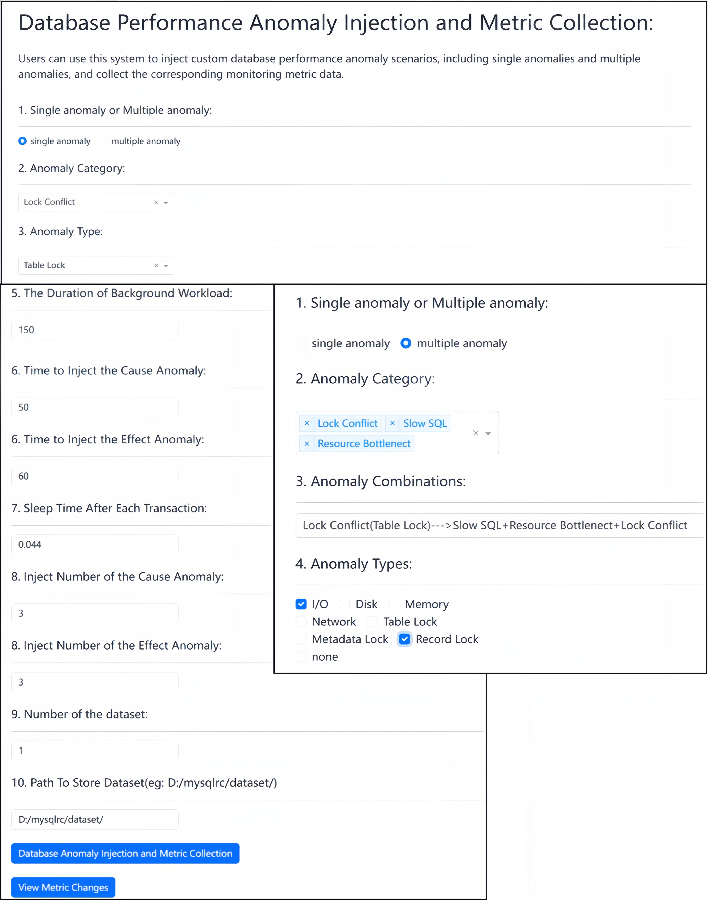
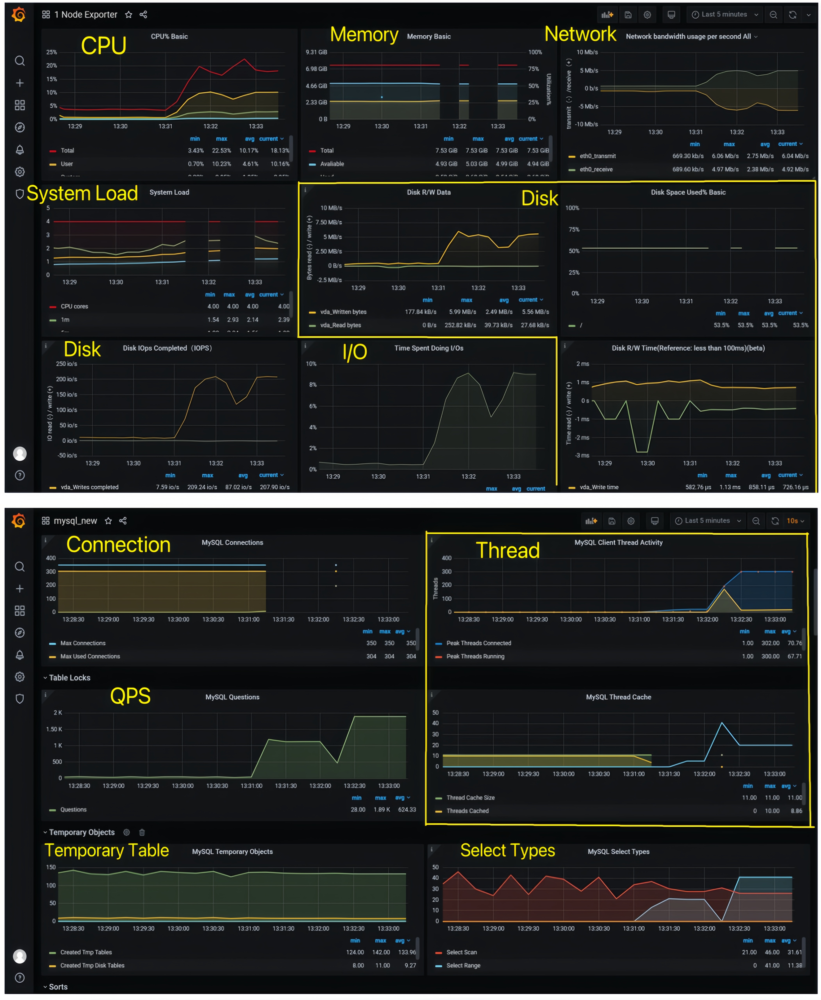

# **DB-MAGS: Multi-Anomaly Data Generation System for Transactional Databases**

This repository contains the source code of multi-anomaly data generation system used in our "DB-MAGS: Multi-Anomaly Data Generation System for Transactional Databases" VLDB demo paper. 

Existing database performance anomaly datasets have the problems of comprehensiveness in anomaly types, coarse-grained root causes, and unrealistic simulation for reproducing concurrent anomalies. To address these issues, we propose a data generation system tailored for Multi-Anomaly Reproduction in Databases (DB-MAGS). DB-MAGS guarantees unified, authentic, and comprehensive data generation, while also providing fine-grained root causes. In the case of only a single anomaly occurred in the database, we categorize the factors affecting database performance anomalies, select five major categories of anomalies, and further subdivide each category into eighteen minor categories. This finer granularity of anomaly classification facilitates more specific and targeted anomaly remediation. For multiple anomalies simultaneously occurred in a database system, we categorize the relationships between anomalies into causal and concurrent, and enumerate different combinations of multiple anomalies, making the simulation of multiple anomaly scenarios more comprehensive and enhancing the diversity of generated data.

(1) **Reproducing Database Performance Anomalies via URL**

- startup frontend

  python web/web.py

- open the web page

  http://127.0.0.1:8050/

(2) **Reproducing Database Performance Anomalies via Python Command**

- single anomaly

  python Case_make/Case_make.py -d 200 -t 60 -x 55 -i 5 -s 0.044 -c 7 -e 7 -n 10

- multiple anomaly

  python Case_make/Case_make_multi.py -d 150 -t 60 -x 55 -i 'lock--->slow+lock+slow' -k 'record_lock+missing_index' -s 0.044 -c 7 -e 7 -n 10

